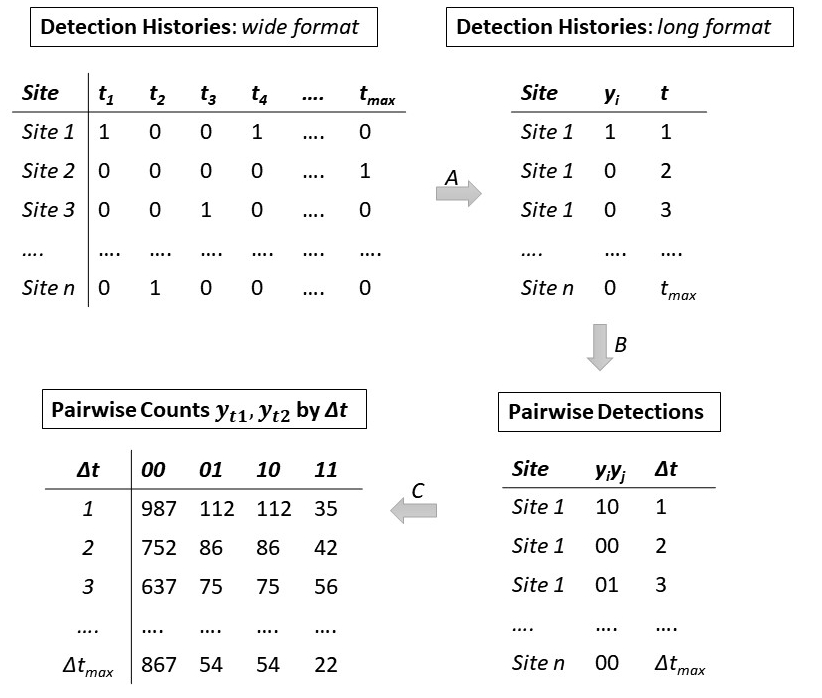

```{r, include = FALSE}
knitr::opts_chunk$set(fig.align = "center", fig.width = 7, fig.height = 4, 
  collapse = TRUE,
  comment = "#>", 
  cache = 1, cache.extra = knitr::rand_seed, autodep = TRUE
)
# Load libraries
library(ggplot2)
library(tictoc)
library(tidyverse)
library(boot)
library(gridExtra)
```


# 1. Introduction 

The __lorelogram__ package provides functions to explore and graphically describe correlation structures in binary data. The package is available on GitHub and can be downloaded in R [@RCoreTeam2018] via:

```{r load pkg, warning = FALSE, message = FALSE, results = 'hide', eval=FALSE}
if (!require("devtools")) install.packages("devtools", 
                                           repos = "http://cran.us.r-project.org", 
                                           dependencies = "Imports")
devtools::install_github("FabiolaIannarilli/lorelogram", 
                         auth_token = "69451dbc8b643e18d5e25b488e0a485b59a93512") 
```

```{r}
library(lorelogram)
```

The lorelogram is a tool to identify dependency structure in binary data. In @Iannarilli, we should how it can be used to guide data aggregation efforts to facilitate independence, or alternatively, to inform appropriate structures for modelling correlated data. 
<!---
explore the effect of covariates on correlation . It can also be applied to explore the dependency at different spatial or temporal scales (e.g., camera trap data analyzed at the hour- or minute-scale) within a certain dataset. 

JF: Note: I think we should keep the into as simple and general as possible. We could included some of the intro material from the paper, describing how to calculate the lorelogram, though I don't think that is strictly necessary.
-->
The method was originally developed by @Heagerty1998  to describe dependence structures in longitudinal categorical data using marginal pairwise conditional log-odds ratios. For details on the method and examples of applications in ecological studies see @Iannarilli.
Here we focus on guiding new users on how to apply the lorelogram to their own dataset. 

<!---
We provide worked examples, and compare the efficiency of our `lorelogram` function with other options available in R [@RCoreTeam2018] for calculating the lorelogram. 
JF: Note: I deleted since these comparisons have been moved to the supplementary appendix...
--->
The main function in the __lorelogram__ package is called `lorelogram`. This function allows users to calculate log-odds ratio at each spatial or temporal lag up to a maximum interval between subsequent observations. It also returns a plot of the log-odds ratio estimates versus lag, the lorelogram plot, that graphically represents how the correlation changes with the increase of the spatial or temporal lag between observations. 

We use the data associated with the package to provide a first example. This dataset consists of detection/nondetection data of gray fox (_Urocyon cinereoargenteus_) collected using camera traps at 100 locations in Northern Minnesota during fall 2016. We provided details on the structure of this data in the [Data format](#data-format) section whereas further data on the sampling protocol are available at <https://drive.google.com/drive/folders/12cx59tZvPndOWqH7TG6XKGPFd6HyBjMR?usp=sharing>. We load the data and apply the `lorelogram` function. 

```{r ex1}
data("GrayFox_Hour")
lorelogram(GrayFox_Hour, max_lag = 30)
```

The `lorelogram` function returns a plot of the estimates and a data frame containing the estimated average log-odds ratio values and associate 95% confidence interval at each lag upon to a maximum defined by the argument `max_lag`. The data frame component of the output can be assigned to an object that can be later used as the argument for the function `lor_plot`. This second function allows users to save the plot as a jpeg file in a directory of their choice and have more control over plot features. For example, using `lor_plot` we can assign a title to the plot, change the default label for the x axis and the linetype, specify the color of the 95% confidence interval, the  distance between tic marks along the x axis, and the range of the y axis.

```{r ex2}
LORs <- lorelogram(GrayFox_Hour, plot_LOR = FALSE)
lor_plot(LORs, save_LOR_plot = FALSE, title = "My first lorelogram", 
         x_axis_title = "Lag (Hour)", colour="red", linetype = "dashed",
         x_break = 24, ylim = c(-2,5))
```


# 2. How to apply the lorelogram

In this section we are going to illustrate [how to apply](#data-format) the `lorelogram` function to new datasets, discuss how to [interpret the lorelogram](#interpreting-the-lorelogram), briefly introduce an [approach that can account for site-to-site variability while exploring serial dependence](#accounting-for-site-to-site-variability),  demonstrate the use of  [binnning](#binning-data), and show how to determine [time to independence](#identify-the-minimum-interval-to-approximate-independency) using a derivative-based approach.   

## 2.1 Data format 

The `lorelogram` function accepts both wide and long data formats. __Wide format__ data must contain a sampling unit identifier in the first column and the binary data in the following columns, one column for each sampling ocassion. Each row must represent a sampling unit. In the wide format, it is important to order the columns from first to last sampling occasion (with data for the first replicate contained in the second column, second replicate in third column, and so on) because the order of the columns will be used by the function to define the spatial or temporal interval between two outcomes within a sampling unit.

```{r ex3}
GrayFox_Hour[24:28, 1:31]
```

In this subset of the GrayFox_Hour data, each column after the first records a binary event (0 when the species was detected and 0 otherwise). The subset of the data shown here have been collected at five sites during the first 30 hours of sampling. Note that the columns are ordered from hour 1 (column 'o1') to hour 30 (column 'o30'). NAs indicate occasions in which the camera trap at a certain site was not yet active (e.g., sites 6A and 6C); at site 6B the camera trap was deployed and activated at the 25th hour. 

When data are supplied in the __long format__,  the data set must contain three columns organized in the order described here. The first column contains the sampling unit identifier, the second contains numeric values indicating the time or space of each replicate, the last column contains the binary outcome.

```{r ex4}
data("GrayFox_Hour_long")
GrayFox_Hour_long[2501:2520,]
```

These data are a subset of the same gray fox data used in the previous examples but organized in the long format and show the detection/nondetection outcomes (column 'y') at twenty different camera sites (column 'id') at the 26th hour of sampling (column 'time'). 

Sites at which there are no detection events (i.e. no 1's) for the whole sampling period are automatically removed from the dataset because they do not contain information on correlation among detections. The `lorelogram` function handles missing values (i.e. NAs) in the data; for each sampling unit, these values will be removed before creating the pairwise detection histories at the different intervals.

## 2.2 Interpreting the lorelogram 

Lorelogram plots provide a graphical description of how the correlation in the data changes with the increase of the interval between sampling occasions. Their interpretation varies 
<!---based on the resolution of the data (e.g., hour- versus minute-scale), and 
--->
depending on the context in which it is applied (e.g., spatial versus temporal dependency). Here we provide some general guidance on how to interpret the lorelogram by applying the function to simulated data. In general, log-odds ratio estimates equal to zero suggest no correlation among outcomes x-units apart. Positive or negative values indicate instead positive or negative correlation, respectively.

We simulate data for 1000 sampling ocassions at each of 30 sites, with log odds of detection equal to 0 for the entire study period. An autocorrelation component of first order (i.e. AR1) determines a short-term dependency in the data, that is, outcomes few lags apart are strongly correlated. We simulate the data and calculate the lorelogram.

```{r ex 5}
# Prepare to simulate
set.seed(129)
M <- 30                            # Number of sites
J <- 1000                          # Number of occasions
y <- matrix(NA, nrow=M, ncol=J)    # to store obs values
time <- matrix(data=seq(1,J,1), nrow=M, ncol=J, byrow=TRUE) # Create covariate time
b0<-rep(0, J)                      # Stationary mean 

# Simulate ar1 errors 
rho<-0.75 # autocorrelation parameter on logit scale
eps<-matrix(NA, nrow=M, ncol=J) # to hold errors
for(i in 1:M){ #autocorrelation
  eps[i,1:J]<- t(arima.sim(n =J, list(ar = rho), innov=rnorm(J, mean = 0, sd=0.5))) 
}

# Determine ps 
p <- inv.logit( matrix(b0, nrow=M, ncol=J, byrow=TRUE) + eps)   

# Simulate detection process
for(j in 1:J){
  y[,j] <- rbinom(M, 1, p[,j])
}

# create and add ID column to the data and prepare the data
y <- as.data.frame(cbind(id=paste("S", seq(1,M,1), sep=""),y))
colnames(y) <- c("id", paste0("R", seq(1, J, 1), sep=""))
Stat_data <- y

# Applying lorelogram
LOR_Stat_data <- lorelogram(Stat_data, max_lag = 30)

```

The lorelogram has large positive values for short-time lags, but quickly decreases to 0 for observations $\ge$ 10 units apart. Thus, we conclude that observations  exhibit short-term serial dependence and that observations > 10 units apart are approximately independent. 

In the second example, we again simulate observations with serial dependence, but we allow the mean to be non-stationary. 

```{r ex 6}
# Prepare to simulate
set.seed(129)
M <- 30                            # Number of sites
J <- 1000                          # Number of occasions
y <- matrix(NA, nrow=M, ncol=J)    # to store obs values
time <- matrix(data=seq(1,J,1), nrow=M, ncol=J, byrow=TRUE) # Create covariate time
b0<-2-0.004*time[1,]               # NON Stationary mean 

# Simulate ar1 errors 
rho<-0.75 # autocorrelation parameter on logit scale
eps<-matrix(NA, nrow=M, ncol=J) # to hold errors
for(i in 1:M){  #autocorrelation
  eps[i,1:J]<- t(arima.sim(n =J, list(ar = rho), innov=rnorm(J, mean = 0, sd=0.5)))
}

# Determine ps 
p <- inv.logit( matrix(b0, nrow=M, ncol=J, byrow=TRUE) + eps)   

# Simulate detection process
for(j in 1:J){
  y[,j] <- rbinom(M, 1, p[,j])
}

# create and add ID column to the data and prepare the data
y <- as.data.frame(cbind(id=paste("S", seq(1,M,1), sep=""),y))
colnames(y) <- c("id", paste0("R", seq(1, J, 1), sep=""))
NonStat_data <- y

# Applying lorelogram
LOR_NonStat_data <- lorelogram(NonStat_data, max_lag = 30)

```

The lorelogram again decreases for the first 10 time lags, but this time the curve levels off at a log-odds ratio value higher than zero. In this case, the non-stationary mean creates a dependence that does not decrease with time between observations. For more discussion and other examples see @Iannarilli (fig. 2 and S1-2 in Appendix).

Methods to account for this residual correlation exists (see @Iannarilli section 3 for a list), but these methods are computationally demanding and not yet easy to implement in R. Site-to-site variability, a common source of correlation in ecological data, can be controlled following the approach described in [section 2.6](#accounting-for-site-to-site-variability).

## 2.3 How the `lorelogram` function works 

The lorelogram requires binary data for 1 or more sampling units (e.g.  camera sites). The `lorelogram` function first removes sampling units than have no 1's, and, if necessary, converts the binary data from wide to long format (Fig. 1, step A). Then, for each sampling unit, it creates pairs of outcomes $y_{i}$ and $y_{i+\Delta t}$ for all the possible combination of replicates that are between 1 and ≤ `max_lag` units  apart (Fig. 1, step B). The combinations are obtained using the function `combinations` in package __arrangements__ [@Lai2018], whereas the pairing is performed using the `nest` and `unnest` functions in __tidyverse__ [@Hadley2017]. For each discrete interval (i.e. 1 through `max_lag`), the function tabulates the number of occurrences of each pairwise detection history ‘11’, ‘10’, ‘01’, or ‘00’ within a sampling unit. These detection histories are then pooled across sampling units (Fig. 1, step C). In the empirical lorelogram, these values are used to calculate the average log-odds ratio value at each interval as: $$LOR=\log{\frac{n_{11}n_{00}}{n_{01}n_{01}}}.$$ 

The 95% confidence interval at each lag is calculated as: $$95\% \mbox{ } CI = LOR\pm1.96*\sqrt{\frac{1}{n_{11}}+\frac{1}{n_{00}}+\frac{1}{n_{10}}+\frac{1}{n_{11}}}.$$

```{r lorfig, fig.cap=" Figure 1. Conceptual diagram illustrating how the `lorelogram` function works. This example demonstrates how camera trap data are converted from detection histories to the counts used to calculate the lorelogram values (i.e. pairwise log-odds ratios). Detection histories are first converted from wide to long format (A), then the function compiles the outcomes $y_{i}$ and $y_{j}$ as pairwise detections based on all the possible pairwise combinations of time _i_ and _j_ within the maximum time lag ($\\Delta t$) considered (B). Finally, for each value of $\\Delta t$, the function counts the number of 00, 01, 10, 00 detection histories, pooling pairwise detections across  all sites (C).", fig.align='center', out.width="75%", echo=FALSE}



```


## 2.4 Identify the minimum interval to approximate independence 

A visual inspection of the lorelogram plot is often sufficient to identify the minimum lag at which serial dependence is no longer present. However, the __lorelogram__ package provides the `lor_lag_to_indep` function to support a more rigorous selection of this threshold. This function requires a data frame containing the output of the `lorelogram` function. To illustrate how `lor_lag_to_indep` works, we use the log-odds ratios stored in the object named _LOR_NonStat_data_  and estimated by `lorelogram` applied to the non-stationary data with  short-term dependency structure simulated in [section 2.2](#interpreting-the-lorelogram). We identify the lag at which serial dependence is approximately 0 using the `lor_lag_to_indep` function.

```{r ex7}
#' Identify interval to reach independency
lor_lag_to_indep(LOR_NonStat_data)
```

In a first step, the `lor_lag_to_indep` function fits a smoothing cubic spline to the log-odds ratios estimated by the `lorelogram` function. Then, it calculates the first derivative of the spline curve and identifies the lag at which the derivative is closest to 0 (in absolute value). 


## 2.5 Binning data 

The lorelogram is undefined whenever $n01$ or $n10$ is 0 and it is equal to negative infinitiy when either $n11$ or $n00$ is 0.  A common strategy to avoid this problem is to apply the alternative formulation $$LOR=\log{\frac{(n_{11}+0.5)(n_{00}+0.5)}{(n_{10}+0.5)(n_{01}+0.5)}}$$ [@Agresti1990, pp. 54-55]. This formula is used when the `lor_adj` argument in `lorelogram` function is set equal to "TRUE". 

Binning  the data offers another solution when data are sparse. The choice of bin width represents a bias-variance tradeoff (large bins reduce variance at the cost of introducing bias). See e.g.,  <https://support.esri.com/en/technical-article/000004923>. Our main goal here, when binning data, is to reduce gaps in the lorelogram when detections are sparse. Using the `bin_width` argument in `lorelogram` users can test several binning values and choose the one that they think is most appropriate for their dataset. To illustrate the process we use the gray fox data, this time organized at the minute scale (instead of hour scale) and select only sites where salmon oil was applied as a lure. More details about the data are available in the READme.txt file at <https://drive.google.com/drive/u/0/folders/12cx59tZvPndOWqH7TG6XKGPFd6HyBjMR> through the University of Minnesota Data Repository DRUM.

We compare results obtained without binning and results obtained using a binning value of 10. The plots illustrate that binning the data is not only helpful to fill in the gaps in the lorelogram, but it also helps in smoothing the curve and reducing the uncertainty in the estimates. 

```{r ex 8}
#' Load data
data(GrayFox_minute_lureSal)

# bin_width = 1 corresponds to no binning
tic()
LORs_no_bin <- lorelogram(GrayFox_minute_lureSal, max_lag = 60, bin_width = 1, plot_LOR = FALSE)
toc()

# bin_width = 10
tic()
LORs_10_bin <- lorelogram(GrayFox_minute_lureSal, max_lag = 60, bin_width = 10, plot_LOR = FALSE)
toc()

LORs_no_bin$binning <- "bin_width = 1"
LORs_10_bin$binning <- "bin_width = 10"

LORs <- rbind(LORs_no_bin, LORs_10_bin)

LORs %>% mutate(binning = factor(binning, levels = c("bin_width = 1", "bin_width = 10"))) %>% 
  ggplot(., aes(x = Lag, y = LORs))+
  geom_line(aes(linetype = binning, color = binning), size = 0.5)+
  geom_ribbon(aes(ymin=L_95_CI, ymax=U_95_CI, color = binning, fill = binning), alpha=0.7)+
  geom_hline(yintercept = 0) +
  labs(y = "Log-odds ratio") +
  ggplot2::theme_minimal() +
  ggplot2::theme(legend.justification = c(1, 1), legend.position = c(0.99,0.99),
                 legend.title = element_text(size=10, face = "bold"),
                 legend.text = element_text(size=8),
                 legend.background = element_rect(fill = "white", color = "grey"), 
                 legend.direction = "vertical",
                 axis.line.y = ggplot2::element_line(colour = 'black', linetype = 'solid'),
                 axis.ticks.y = ggplot2::element_line(colour = 'black', linetype = 'solid'),
                 axis.text = ggplot2::element_text(size=8),
                 axis.title = ggplot2::element_text(size=10,face="bold"),
                 panel.grid.minor.y = ggplot2::element_blank(),
                 panel.grid.major.y = ggplot2::element_blank(),
                 panel.grid.major.x = ggplot2::element_line(colour = 'grey', linetype = 'solid',
                                                            size=0.25),
                 panel.grid.minor.x = ggplot2::element_line(colour = 'grey', linetype = 'dashed',
                                                            size=0.25))+
  ggplot2::scale_x_continuous(breaks=seq(0,max(LORs$Lag),10), labels=seq(0,max(LORs$Lag),10))
```

## 2.6 Accounting for site-to-site variability 

A common source of correlation in ecological studies is due to variability among sites (i.e. sampling units).
<!---
In [section 2.2](#interpreting-the-lorelogram) we explore lorelogram's response when additional correlation structures (in that case, non-stationarity) beyond that targeted by the lorelogram are present in the data. 

JF: just tried to simplify
--->
Similar to the non-stationary example in [section 2.2](#interpreting-the-lorelogram), site-to-site variability will cause the lorelogram to level off at a log-odds ratio higher than zero. Interestingly, we can adjust for this dependence using a generalized linear mixed model approach that includes sampling units as a random effect. Thus, we provide the option to adopt this method in `lorelogram` by setting the argument `lor_type` equal to `model-based` and the argument `id_rand_eff` equal to `TRUE`. We illustrate the process using simulated data containing a short term correlation structure (that is targeted by the lorelogram) and a non-serial component due to site-to-site variability.  

```{r ex 9}
# Prepare to simulate
set.seed(129)
M <- 30                            # Number of sites
J <- 1000                          # Number of occasions
y <- matrix(NA, nrow=M, ncol=J)    # to store obs values
time <- matrix(data=seq(1,J,1), nrow=M, ncol=J, byrow=TRUE) # Create covariate time
b0<-rep(0, J)                      # Stationary mean 

# Simulate site-to-site variability
sdtau<-0.8     # site-level variability
taus<-rnorm(M, 0, sdtau)

# Simulate ar1 errors (pick whichever is appropriate)
rho<-0.75 # autocorrelation parameter on logit scale
eps<-matrix(NA, nrow=M, ncol=J) # to hold errors
for(i in 1:M){ #autocorrelation
  eps[i,1:J]<- t(arima.sim(n =J, list(ar = rho), innov=rnorm(J, mean = 0, sd=0.5))) 
}

# Determine ps 
p <- inv.logit( matrix(b0, nrow=M, ncol=J, byrow=TRUE) + matrix(taus, nrow=M, ncol=J, byrow=FALSE) 
                + eps)   

# Simulate detection process
for(j in 1:J){
  y[,j] <- rbinom(M, 1, p[,j])
}

# create and add ID column to the data and prepare the data
y <- as.data.frame(cbind(id=paste("S", seq(1,M,1), sep=""),y))
colnames(y) <- c("id", paste0("R", seq(1, J, 1), sep=""))
Site_var_data <- y

# Applying empirical lorelogram
tic()
LOR_empirical <- lorelogram(Site_var_data <- y, max_lag = 30, lor_type = "empirical", plot_LOR = FALSE)
toc()
plot_emp <- lor_plot(LOR_empirical, colour = "green", title = "Empirical", ylim = c(-0.05,1))

# Applying model-based lorelogram without random effect
tic()
LOR_mod_noRE <- lorelogram(Site_var_data <- y, max_lag = 30, lor_type = "model-based", 
                           id_rand_eff = FALSE, plot_LOR = FALSE)
toc()

# Applying model-based lorelogram without random effect
tic()
LOR_mod_RE <- lorelogram(Site_var_data <- y, max_lag = 30, lor_type = "model-based", 
                         id_rand_eff = TRUE, plot_LOR = FALSE)
toc()

LOR_mod_noRE$Method <- "Model - no site effect"
LOR_mod_RE$Method <- "Model - with site effect"

LORs <- rbind(LOR_mod_noRE, LOR_mod_RE)

plot_mod <- ggplot(LORs, aes(x = Lag, y = LORs))+
  geom_line(aes(linetype = Method, color = Method), size = 0.5)+
  geom_ribbon(aes(ymin=L_95_CI, ymax=U_95_CI, color = Method, fill = Method), alpha=0.7)+
  geom_hline(yintercept = 0) +
  labs(y = "Log-odds ratio", title = "Model-based") +
  coord_cartesian(ylim = c(-0.05,1)) +
  ggplot2::theme_minimal()+
  ggplot2::theme(legend.justification = c(1, 1), legend.position = c(0.99,0.99),
                 legend.title = element_text(size=10, face = "bold"),
                 legend.text = element_text(size=8),
                 legend.background = element_rect(fill = "white", color = "grey"), 
                 legend.direction = "vertical",
                 axis.line.y = ggplot2::element_line(colour = 'black', linetype = 'solid'),
                 axis.ticks.y = ggplot2::element_line(colour = 'black', linetype = 'solid'),
                 axis.text = ggplot2::element_text(size=8),
                 axis.title = ggplot2::element_text(size=10,face="bold"),
                 panel.grid.minor.y = ggplot2::element_blank(),
                 panel.grid.major.y = ggplot2::element_blank(),
                 panel.grid.major.x = ggplot2::element_line(colour = 'grey', linetype = 'solid',
                                                            size=0.25),
                 panel.grid.minor.x = ggplot2::element_line(colour = 'grey', linetype = 'dashed',
                                                            size=0.25))+
  ggplot2::scale_x_continuous(breaks=seq(0,max(LORs$Lag),10), labels=seq(0,max(LORs$Lag),10))

grid.arrange(plot_emp, plot_mod, ncol = 2)

```

When estimating the empirical lorelogram, the lorelogram curve levels off at a log-odds ratio value higher than zero, even when data are stationary, due to the site-to-site variability. However, when applying the model-based approach. including sampling units as random effect, the  correlation due to site-to-site variability is removed.


# References
